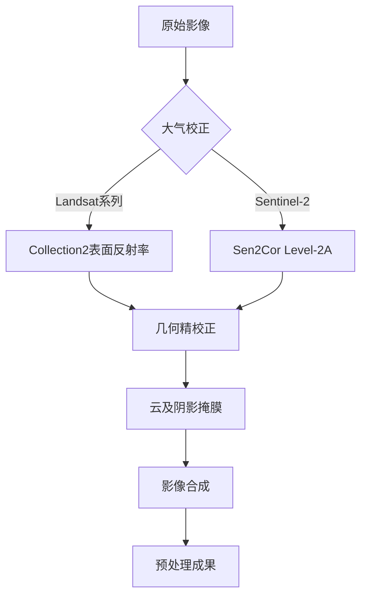
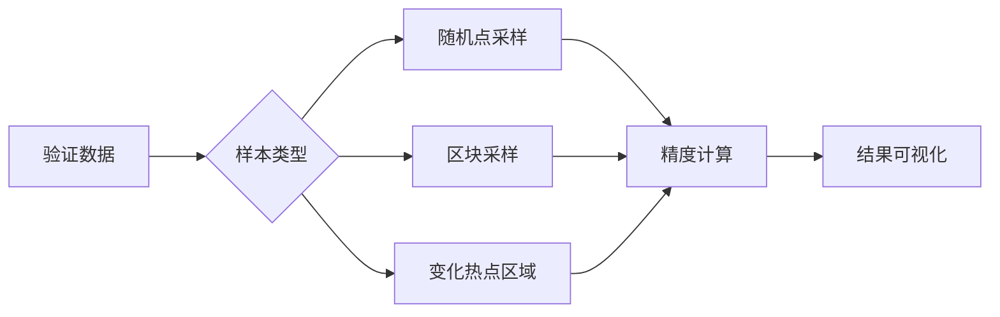
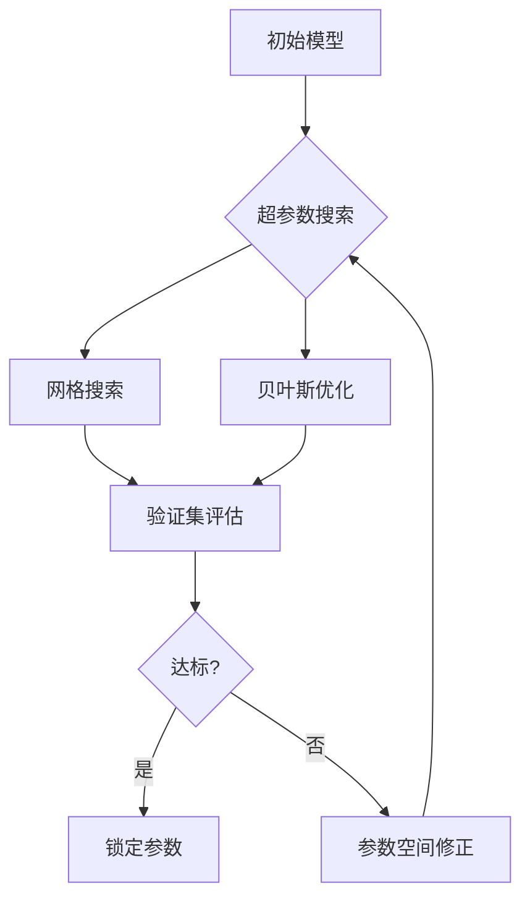
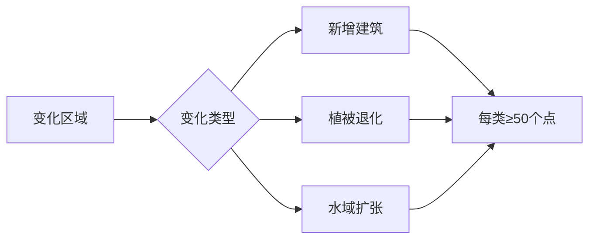

# 基于卫星影像数据的土地利用变化检测系统

## 1. 数据收集

考虑数据可达性与，选择采用Google Earth Engine（GEE）[1]作为开发平台。其基于Google公司，提供多种免费遥感影像数据集，分辨率较为优秀，同时提供时间序列遥感影像，便于分析变化检测。常用数据集包括：

- **Landsat系列（TM/ETM+/OLI）**[2]：美国USGS/NASA联合任务，自1972年起观测地表。当前的Collection 2数据为**30米**多光谱分辨率（L8亦有15米全色波段、100米热红外），全球每约16天重访一次。适用于长期土地覆被变化监测和统计。
- **Sentinel-2**[3]：欧空局（ESA）任务，搭载13个波段的多光谱仪。可见光和近红外波段分辨率**10米**，红边及短波红外**20米**，大气校正波段**60米**。两星组合重访周期可达5天，用于高精度植被、农作物和土地覆被分类。
- **Sentinel-1 (SAR)**[4]：ESA C波段（5.4 GHz）合成孔径雷达，单极化或双极化（VV、VH等），分辨率可达**10米**，6天重访。全天候观测能力使其在洪水、湿地和森林监测中很有价值。
- **MODIS (Terra/Aqua)**[5]：美国NASA的中分辨率传感器，覆盖36个波段，包括可见光、红外和热红外，分辨率**250米/500米/1000米**，每1–2天覆盖全球一次。MODIS产品（如16日合成NDVI、全球地表覆盖图MCD12Q1等）可用于大尺度植被指数和土地覆盖变化分析。
- **其他数据**：如高分辨率商业卫星（PlanetScope等）、航空摄影或无人机影像等可补充验证，但需手动导入；GEE也内置全球DEM、气候和土地覆被图层，可辅助分析。

下表总结了主要数据源数据基本信息：

| 卫星/传感器 | 空间分辨率（米）              | 主要波段（范围）                            | 重访周期    | 应用示例                     |
| ----------- | ----------------------------- | ------------------------------------------- | ----------- | ---------------------------- |
| Landsat-8/9 | 30（MS）/15（PAN）/100（TIR） | 可见光-近红外（0.43–2.29μm）、热红外        | ~16天       | 长时序土地覆盖变化、植被指数 |
| Sentinel-2  | 10/20/60                      | 可见光-近红外（0.44–0.83μm）、红边/短波红外 | 5天（双星） | 精细农作物分类、城市扩张监测 |
| Sentinel-1  | 10–40（SAR）                  | C波段雷达极化（VV/VH/HV/HH）                | 6天         | 全天候变更检测（洪水、森林） |
| MODIS       | 250/500/1000                  | 36波段（可见光至热红外）                    | 1–2天       | 全球植被监测、土地覆被产品   |

使用GEE，可以调用 `ee.ImageCollection()` 方法获取指定时间序列范围全部遥感图像，以Sentinel-2为例：

```python
// 设定范围和缩放级别
var geometry = ee.FeatureCollection('users/huiengine/test_roi')
Map.centerObject(geometry,16);

// 获取图像集合
var collection = ee.ImageCollection('COPERNICUS/S2_SR')
  .filterDate('2020-01-01', '2023-12-31')
  .filterBounds(geometry);
```

## 2. 数据预处理

在分析前，需要对影像进行预处理。

### 2.1 标准化处理框架  

标准化处理框架如下图所示，需要经过大气校正、几何校正、去云、阴影掩膜等。



### 2.2 关键处理步骤详解  
#### **1. 大气校正**  
| 卫星类型        | 处理方法                                                | GEE实现代码片段                      |
| --------------- | ------------------------------------------------------- | ------------------------------------ |
| **Landsat-8/9** | 调用Collection2表面反射率产品，已集成LEDAPS大气校正算法 | `ee.Image('LANDSAT/LC08/C02/T1_L2')` |
| **Sentinel-2**  | 采用Sen2Cor处理器生成的Level-2A数据，包含地形辐射校正   | `ee.Image('COPERNICUS/S2_SR')`       |
| **MODIS**       | 使用MOD09GA陆表反射率产品                               | `ee.Image('MODIS/006/MOD09GA')`      |

#### **2. 几何校正**  
| 校正类型   | 实施方式                                                     | 精度指标         |
| ---------- | ------------------------------------------------------------ | ---------------- |
| 系统级校正 | 数据提供商已完成地形校正（SRTM DEM）                         | 误差<12m（CE90） |
| 精细配准   | 对特殊区域采用GCP控制点人工校正：<br>- 选取道路交叉点/建筑物顶点作为基准点 | 误差<0.5像素     |

#### **3. 云及噪声掩膜**  
对于不同的模态数据，可以选择不同掩膜技术组合方案，具体有如下：

| 卫星平台       | 掩膜方法                                  | 适用场景       |
| -------------- | ----------------------------------------- | -------------- |
| **Landsat**    | `simpleCloudScore`算法+QA波段联合判读     | 中低云量区域   |
| **Sentinel-2** | SCL场景分类层+s2cloudless概率图双阈值过滤 | 高精度云检测   |
| **MODIS**      | 状态标志位(StateQA)与云置信度联合判定     | 快速大区域处理 |

### 2.3 质量评估指标  
| 评估维度   | 检测方法                             | 合格标准     |
| ---------- | ------------------------------------ | ------------ |
| 云残留率   | 人工验证100个随机点云掩膜效果        | ≤3%          |
| 几何精度   | 与Google Earth高清影像进行同名点比对 | RMSE<0.5像素 |
| 辐射一致性 | 计算相邻影像重叠区波段相关性         | R²>0.85      |
| 时相完整性 | 统计季度合成影像有效像元占比         | ≥95%         |

### 2.4 预处理可视化
可以通过以下几张图片进行组合可视化，直观展示预处理效果：

* (a) 原始影像（云污染严重）  

- (b) 云掩膜结果（红色为被剔除区域）  
- (c) 中位数合成影像（无缝衔接）  
- (d) 辐射校正前后光谱曲线对比（消除大气吸收峰）  

## 3. 特征工程

从预处理后的影像中提取分类所需特征。在多光谱维度上常用的光谱指标包括NDVI (Normalized Difference Vegetation Index)、NDWI (Normalized Difference Water Index)、NDBI (Normalized Difference Built-up Index) 等，用于区分植被、水体、裸土和建筑区。

除了光谱指数，还可计算光谱波段的统计特征（如各波段均值、方差）和纹理特征。典型做法是基于灰度共生矩阵提取纹理参数，如均值、标准差、同质性、对比度、熵等。例如，表中研究中提取了各光谱波段的平均值和标准差，以及NDVI、NDWI、NDBI等指标，同时计算各波段对应的GLCM纹理特征。此外，可利用PCA提取影像的主成分作为特征，以减少冗余。综合这些光谱和纹理特征作为输入，可显著提高土地利用类型之间的可分性。

### 3.1 多维度特征体系 
#### 3.1.1 光谱特征  

主要计算有如下公式，其基于波段反射率值计算，在GEE平台上，这些指数可用波段代数直接实现，如`normalizedDifference`、`expression`等函数：

- **归一化植被指数NDVI**：$\mathrm{NDVI} = \frac{\text{NIR} - \text{Red}}{\text{NIR} + \text{Red}}$，强调自然植被区。
- **归一化建筑指数NDBI**：$\mathrm{NDBI} = \frac{\text{SWIR} - \text{NIR}}{\text{SWIR} + \text{NIR}}$，强调人工建筑区。
- **归一化水体指数NDWI**：$\mathrm{NDWI} = \frac{\text{Green} - \text{NIR}}{\text{Green} + \text{NIR}}$​， 强调水体。
- **土地表面温度LST**：利用热红外波段计算。首先将热红外辐亮度$L$转换为亮温$BT$，$BT = \frac{K_2}{\ln(K_1/L) + 1}$（$K_1$，$K_2$为传感器定标常数），然后根据地表发射率$\varepsilon$计算$LST$，$LST = \frac{BT}{1 + (\lambda\, BT / c_2)\ln\varepsilon}$，其中$\lambda$为发射波长、$c_2=1.4388\times10^4 µm·K$。
- **增强型植被指数EVI**：$\mathrm{EVI} = 2.5 \times \frac{\text{NIR} - \text{Red}}{\text{NIR} + 6\times\text{Red} - 7.5\times\text{Blue} + 1}$
- **土壤调节植被指数SAVI**：$\mathrm{SAVI} = \frac{\text{NIR} - \text{Red}}{\text{NIR} + \text{Red} + L} \times (1+L)$，通常取校正因子$L=0.5$。

#### 3.1.2 统计特征  
| 特征类别   | 计算方法               | 作用                 |
| ---------- | ---------------------- | -------------------- |
| 波段均值   | 单波段像元值平均值     | 反映区域整体光谱强度 |
| 波段方差   | 单波段像元值标准差     | 表征地物内部异质性   |
| 极差统计   | (最大值 - 最小值)/均值 | 检测异常值/突变边界  |
| 分位数特征 | 25%/50%/75%分位数统计  | 描述光谱分布形态     |

#### 3.1.3 纹理特征 
基于灰度共生矩阵（GLCM）的纹理参数提取同样可以基于python实现。包括如下部分：
| 纹理参数 | 物理意义         | 典型应用场景       |
| -------- | ---------------- | ------------------ |
| 对比度   | 局部灰度变化强度 | 建筑与自然地表区分 |
| 同质性   | 灰度分布均匀性   | 农田地块边界识别   |
| 熵值     | 纹理复杂程度     | 森林与灌木丛分类   |
| 相关性   | 空间灰度依赖关系 | 道路线性特征增强   |

#### 3.1.4 时序特征  
针对多时相数据的动态特征提取，主要有以下三种特征：  
| 特征类型   | 计算方法              | 变化检测应用场景       |
| ---------- | --------------------- | ---------------------- |
| 年均值趋势 | 时间序列线性回归斜率  | 长期土地利用演变分析   |
| 季节振幅   | 季度最大-最小值差异   | 作物轮作模式识别       |
| 突变点检测 | CUSUM算法检测时序突变 | 突发性土地覆盖变化预警 |

#### 3.1.5 空间特征  

空间特征同样是遥感影像分析中较为重要的特征，主要有如下几种：

| 特征类型   | 提取方法                   | 作用                   |
| ---------- | -------------------------- | ---------------------- |
| 形态学特征 | 开运算/闭运算处理          | 消除椒盐噪声           |
| 空间上下文 | CRF（条件随机场）建模      | 提升分类结果空间一致性 |
| 对象特征   | 基于eCognition的多尺度分割 | 地块级分类优化         |

### 3.2 特征优化策略 
可以通过降维处理，将提取到的高维特征进行降维，进而获取更加高级语义层面的特征。

| 方法          | 实施步骤                                                     | 效果               |
| ------------- | ------------------------------------------------------------ | ------------------ |
| PCA主成分分析 | 1. 计算协方差矩阵<br>2. 特征值排序<br>3. 保留前3-5个主成分   | 消除波段间冗余信息 |
| 随机森林      | 1. 训练初步分类器<br>2. 输出特征重要性排名<br>3. 筛选Top20特征 | 去除噪声特征       |

#### 3.3 特征可视化  

通过特征可视化，可以更加直观研究特征工程相关情况：

- (a) 原始真彩色合成影像  
- (b) NDVI分布（红色:低植被, 绿色:高植被）  
- (c) GLCM对比度（亮色:纹理复杂区域）  
- (d) 时序特征热力图（暖色:变化剧烈区域）  

## 4、算法选择与模型训练  
在土地利用分类中，常用机器学习算法包括传统分类器和深度学习模型。

### 4.1 分类算法深度对比  
在土地利用分类中，常用机器学习算法包括传统分类器和深度学习模型。随机森林（RF）和支持向量机（SVM）等经典算法易于实现，对少量样本和多类别问题表现稳定，且可以评估特征重要性；RF训练快速、不易过拟合，SVM对高维小样本具有较好泛化性。但在复杂影像场景中，卷积神经网络（CNN）因能自动学习多层次空间特征，通常能取得更高的分类精度。因此可以根据不同的要求进行权衡，选择不同的算法：

- **小样本场景**：优先采用机器学习组合，利用GEE内置`ee.Classifier`实现快速部署  
- **高精度需求**：选用深度网络架构，支持多尺度上下文特征捕捉  

### 4.2 变化检测算法选型  

变化检测是很经典的遥感研究命题，具有大量的相关工作。因此比较不同的算法的效果，并且实现这些算法，根据用户需求进行选择，或者比较。

| 方法               | 精度 (F1-score) | 计算效率 | 标注需求     | 典型工具链    |
| ------------------ | --------------- | -------- | ------------ | ------------- |
| 双时相差分法       | xx              | 极高     | 无           | GEE Image差值 |
| 后分类比较法       | xx              | 中       | 两期全标注   | RF+CNN组合    |
| 变化向量分析 (CVA) | xx              | 高       | 变化阈值定义 | ENVI+IDL      |
| BIT-CDC模型        | xx              | 中       | 变化区域标注 | PyTorch       |
| LandTrendr         | xx              | 低       | 时序参数调试 | GEE API       |

决策路径如下：  
- **快速普查**：GEE内置`ee.ImageCollection.getNeighborhoodChange`实现差值检测；
- **精确制图**：采用所选的双时相深度学习模型。

### 4.3 模型训练策略  
#### 4.3.1 数据划分方案  
| 数据集 | 比例 | 用途       | 采样策略     |
| ------ | ---- | ---------- | ------------ |
| 训练集 | 60%  | 参数学习   | 分层随机抽样 |
| 验证集 | 20%  | 超参数调优 | 空间区块划分 |
| 测试集 | 20%  | 最终评估   | 独立行政区划 |

#### 4.3.2 深度学习训练配置  
对于不同的算法需要有不同的设置。深度学习算法的设置通常由batchsize、epoch、learningrate、lossfunction等，这些都需要进行在学习的过程中调优，选择最好的组合。

### 4.4 算法集成方案  
可以通过混合检测框架进行算法集成：  
1. **初筛层**：GEE云端运行LandTrendr检测年际突变点；
2. **精检层**：本地GPU服务器运行BIT-CDC模型识别变化区域；
3. **验证层**：RF分类器对变化类型进行二次校验。

## 5. 模型验证

### 5.1 核心评估指标矩阵  
| 指标              | 计算公式                                                     | 物理意义                       | 最优阈值 |
| ----------------- | ------------------------------------------------------------ | ------------------------------ | -------- |
| **总体精度 (OA)** | $\frac{TP+TN}{TP+TN+FP+FN}$                                  | 全局分类正确率                 | >85%     |
| **Kappa系数**     | $\frac{P_o-P_e}{1-P_e}$（$P_o$:观测精度，$P_e$:期望精度）    | 剔除随机一致性的真实一致性度量 | >0.8     |
| **F1-Score**      | $\frac{2 \times Precision \times Recall}{Precision + Recall}$ | 类别平衡下的综合性能           | >0.75    |
| **IoU**           | $\frac{TP}{TP+FP+FN}$                                        | 变化检测中斑块重叠度评估       | >0.6     |

通过交叉验证或独立验证集计算这些指标，可判断模型性能及错误类型分布，从而指导后续改进。若发现混淆严重的类别，可追加样本或调整特征，对应调整、优化模型。

### 5.2 多维度验证方法  

#### 5.2.1 分层验证策略  


#### 5.2.2 空间交叉验证  
| 验证模式 | 实施方法                     | 优势                 |
| -------- | ---------------------------- | -------------------- |
| 随机分割 | 全区域随机划分训练/验证集    | 评估全局泛化能力     |
| 空间分块 | 按经纬度网格划分独立验证区   | 检测空间自相关性影响 |
| 时间外推 | 用历史数据训练，未来数据验证 | 验证时序预测能力     |

### 5.3 混淆矩阵深度分析  

通过建立混淆矩阵，对于不同的类别的变化情况进行分析。

### 5.4 验证质量保障措施  
| 措施类型   | 具体实施方法                        | 质量控制标准       |
| ---------- | ----------------------------------- | ------------------ |
| 样本均衡性 | 采用分层抽样确保每类≥100个验证点    | 类别样本量差异<20% |
| 空间代表性 | 按1%密度均匀布设验证格网            | 覆盖率>95%行政区划 |
| 时效性验证 | 对比季度验证结果波动率              | 季度精度波动<3%    |
| 野外核查   | 使用ArcGIS Field Maps采集地面验证点 | 野外验证比例≥10%   |

## 6. 模型调优

为提升模型性能，需要对超参数进行调优。可采用不同方法遍历超参数空间。除了静态调优，还可采用持续学习(Continual Learning)策略：当新的训练数据或新区域数据到来时，增量更新模型，避免从头训练。通过持续迭代，模型能够不断适应多样化的地理环境。

### 6.1 调优框架设计  


### 6.2 关键算法调优策略  
#### 6.2.1 传统机器学习调优  
| 算法     | 核心参数                | 搜索范围               | 优化工具     |
| -------- | ----------------------- | ---------------------- | ------------ |
| 随机森林 | n_estimators, max_depth | [100,500], [5,30]      | Hyperopt     |
| SVM      | C, gamma                | [1e-3,1e3], [1e-5,1e1] | GridSearchCV |

#### 6.2.2 深度学习调优  
| 参数类型   | 调优方法           | 典型参数范围             |
| ---------- | ------------------ | ------------------------ |
| 结构参数   | 网络架构搜索 (NAS) | 层数[3-10], 通道[16-256] |
| 训练参数   | 自适应学习率调度   | lr: [1e-5,1e-3]          |
| 正则化参数 | 动态Dropout率      | rate: [0.2-0.7]          |

### 6.3 持续学习机制  
**增量更新流程**：  
1. **新数据缓冲池**：每月接收GEE推送的5%新样本；
2. **样本筛选**：基于预测不确定性选择信息量大的样本（Entropy>0.8）；  
3. **微调训练**：采用弹性权重巩固(EWC)算法防止灾难性遗忘。

### 6.4 调优效果验证  

通过准确率、推理速度，内存消耗等不同的指标验证效果。

## 7、系统部署与监控  
在GEE环境中，训练好的模型可通过 `ee.Classifier` 应用到大范围数据。

### 7.1 混合部署架构  
**组件构成**：  
- **云端处理层**：GEE执行数据获取、预处理、轻量级分类  
- **边缘计算层**：本地GPU集群运行深度学习模型  
- **存储层**：MinIO对象存储管理历史数据  
- **展示层**：GeoServer发布WMTS服务  

**数据流**：  
```
GEE → Cloud Storage → Kafka → Spark → PyTorch → PostgreSQL → WebGIS
```

### 7.2 自动化任务调度  
任务监控看板如下：

| 指标       | 监控方式             | 告警阈值     |
| ---------- | -------------------- | ------------ |
| 处理延迟   | Prometheus时序数据库 | >2小时       |
| GPU利用率  | NVIDIA DCGM Exporter | <30%或>90%   |
| 分类置信度 | 滑动窗口统计         | 均值下降>10% |

### 7.3 异常处理机制  
通过以下故障恢复策略，可以提高鲁棒性：  
1. 断点续传：使用Checkpoint保存处理进度  
2. 降级方案：自动切换至轻量级模型  
3. 日志分析：ELK堆栈实时解析错误日志  

可以通过以下可视化，监控界面异常状态，以便及时处理：  

- 实时显示分类任务进度条  
- 变化检测热点地图  
- 系统资源消耗热力图  

---

## 8、效果评估与反馈迭代  
为了验证检测结果的可靠性，应结合地面调查和其他数据源进行反馈。比如在高程变化明显或人造设施密集地区，可能需要重点采集样本并重新训练。不断迭代这一反馈循环，使模型对不同区域和季节均保持较高性能。此外，可利用社交媒体、政府土地调查等辅助数据源作为验证参考。通过多源多层次的验证与反馈迭代，持续优化分类和变化检测结果，以满足环境监测机构的精度和时效需求。

### 8.1 多源验证体系  
#### 8.1.1 地面验证方法  
| 验证方式     | 实施工具             | 精度指标   | 成本 |
| ------------ | -------------------- | ---------- | ---- |
| 无人机航拍   | DJI Phantom+RGB相机  | 0.1m分辨率 | 高   |
| 地面样方调查 | ArcGIS Field Maps[7] | 亚米级定位 | 中   |
| 众包数据     | OpenStreetMap标注[8] | 街区级精度 | 低   |

#### 8.1.2 验证点布设规范  


### 8.2 误差溯源分析  
典型问题处理方案：
| 错误类型      | 特征表现             | 优化措施             |
| ------------- | -------------------- | -------------------- |
| 建筑-裸土混淆 | 纹理相似但光谱差异   | 增加NDBI与热红外特征 |
| 林地-灌木错分 | 季节变化导致光谱重叠 | 引入多时相物候特征   |
| 水域-阴影误判 | 反射率接近           | 结合DEM地形阴影校正  |

## 参考工具

[1] https://developers.google.cn/earth-engine

[2] https://developers.google.com/earth-engine/datasets/catalog/landsat-8#:~:text=Landsat%2C%20a%20joint%20program%20of,USGS%20produces%20data%20in%203

[3] https://developers.google.com/earth-engine/datasets/catalog/sentinel-2#:~:text=Sentinel,vegetation%2C%20soil%2C%20and%20water%20cover

[4] https://developers.google.com/earth-engine/datasets/catalog/COPERNICUS_S1_GRD#:~:text=This%20collection%20contains%20all%20of,VV%2BVH%2C%20and%20dual%20band%20HH%2BHV

[5] https://modis.gsfc.nasa.gov/data/#:~:text=The%20MODIS%20instrument%20is%20operating,250m%2C%20500m%2C%20and%201%2C000m

[6] https://www.usgs.gov/landsat-missions/landsat-collection-2-surface-reflectance#:~:text=Landsat%20Collection%202%20Surface%20Reflectance,surface%20to%20the%20Landsat%20sensor

[7] https://www.arcgis.com/index.html

[8] https://www.openstreetmap.org/